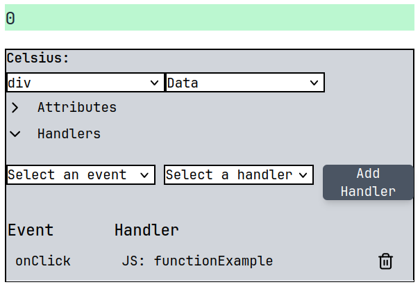

# Implementing custom functionality

To implement custom functionality, the system provides two ways of implementing custom behavior:

1. Custom functions
2. Elm-style messages and update functions

## Messages and Update Functions

### Creating New Messages
1. Locate the Messages element in your canvas
2. Click the "New Message" button to create a message
3. The system will automatically:
   - Create a new message with default name `NewMessageX`
   - Add corresponding case to the update function with default implementation
   - Add the message to available event handlers

### Modifying Update Function
For each message, you can modify how it updates the model:

```javascript
// Example update function for a message
return {
    ...model,            // the existing model
    Count: model.Count + 1,  // Update specific fields
};
```
The update function receives:

- model: Current application state
- event: Browser event that triggered the message
- msg: The message type that was dispatched

### Attaching Messages to Elements

1. Select an element in the ViewElement canvas
2. Open the Event Handlers menu
3. Choose an event type (e.g. "onClick")
4. Select your message from the handler dropdown
5. Click "Add Handler" to attach




Example element with message handler:

## Preview Changes
You can test your custom functionality by:

1. Clicking "Run application" in the ViewElement toolbar
2. Interacting with the elements in preview mode
3. Observing model updates in real-time

The system will execute your update functions and re-render the UI automatically when messages are dispatched.
