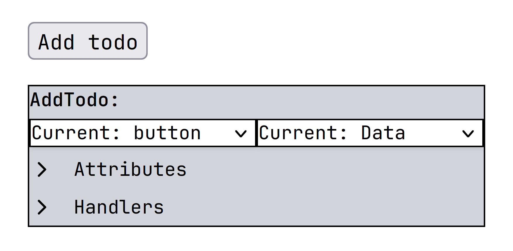

# UI element modification

The created UI elements are previewed in the canvas ViewElement. This is also where the low-code modification menus are displayed right next to the elements themselves. We will now describe the modification menus for each type if created UI element.

## Attributes
We will first describe the attribute menu, as it is common to all the UI elements.
You can define a new attribute by typing its name in the "Attribute Name" input box and then clicking the "Add New Attribute" button.

Under it you can see the created attributes. You can change the key of the attribute by double-clicking it, or change its value.
The value types are:

1. Data - value is set to the value of the corresponding JSON field
2. Constant - user defined value
3. Empty - no value

## Event Handlers
The attribute menu is common to all the UI elements.
To add a new handler, you select an event from the selection on the left and then select the corresponding handler on the right.
The handler is either a user defined custom function or a message.

You can see the created event handlers below this menu and can delete the attached event handlers.

## Hole
You can use the menu you see below to replace the placeholder hole with a new element created based on the underlying data.

## HtmlElement
The HtmlElement is created based on a primitive JSON value. You can change its tag using the provided selection menu on the left.
You can also change its value via the selection menu on the right:

1. Data - value is set to the value of the corresponding JSON field
2. Constant - user defined value
3. Empty - no value

## HtmlList
The HtmlList is created based on the Array JSON type. You can change it to be either ordered or unordered, and also use the event handler and attribute menus.

## HtmlObject
The HtmlList is created based on the Object JSON type. You can change its type using the select menu, and also use the event handler and attribute menus. As we assume the Object is unordered, you can also change the rendering order of its elements using the "Key ordering" menu by clicking the arrows and moving the corresponding keys up and down.

