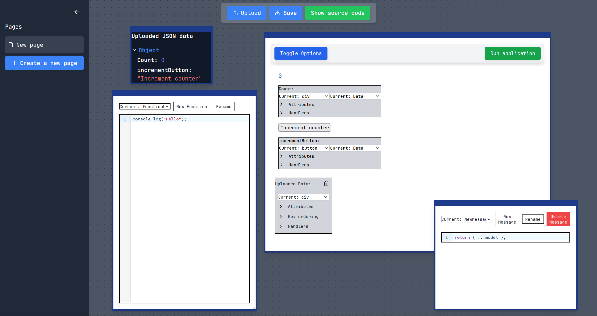

# Getting started

## Installation

To use the InterfaceSmith programming system, we provide two main ways of installing and running it:

1. Using the provided pre-build docker image
2. Building the docker image using the provided Dockerfile

The first option is much faster, as building the image from the Dockerfile involves downloading various technologies and then compiling the entire application and the Docker image, which can take a large amount of time to complete, depending on your internet connection speed and your system's capabilities.

### Prerequisites
- Docker installed and running


### Running the pre-built image
Running the pre-build docker image is the preferred way to run the InterfaceSmith programming system.
To start the container, do the following sequence of steps:

1. Load the provided image:
```bash
docker load < interfacesmith.tar
```

2. Run the loaded container:
```bash
docker run \
  -p 8080:8080 \
  -p 8082:8082 \
  --name interfacesmith \
  interfacesmith:latest
```

### Building the Dockerfile and running the app

1. Clone the repository:
```bash
git clone https://github.com/JerrySvarc/InterfaceSmith.git
cd InterfaceSmith
```
2. Build the Docker image:
```bash
docker build -t interfacesmith .
```

3. Run the newly built container:
```bash
docker run \
  -p 8080:8080 \
  -p 8082:8082 \
  --name interfacesmith \
```


## **Endpoints**
When the container is **running** the following applications are available:

- Main editor is available on: ```http://localhost:8080```
- This documentation is available on: ```http://localhost:8082```


## User interface


*Figure: Main editor interface showing the page management panel on the left and workspace on the right*

After you open the Editor, you will be presented with the application's UI. It consists of a collapsable panel on the left, which provides view of the created pages.
By double clicking on the page tab, the name of the page can be changed. The page can also be deleted by clicking on the thrash bin icon on the tab.

New page can be created by clicking the 'New page' button.
